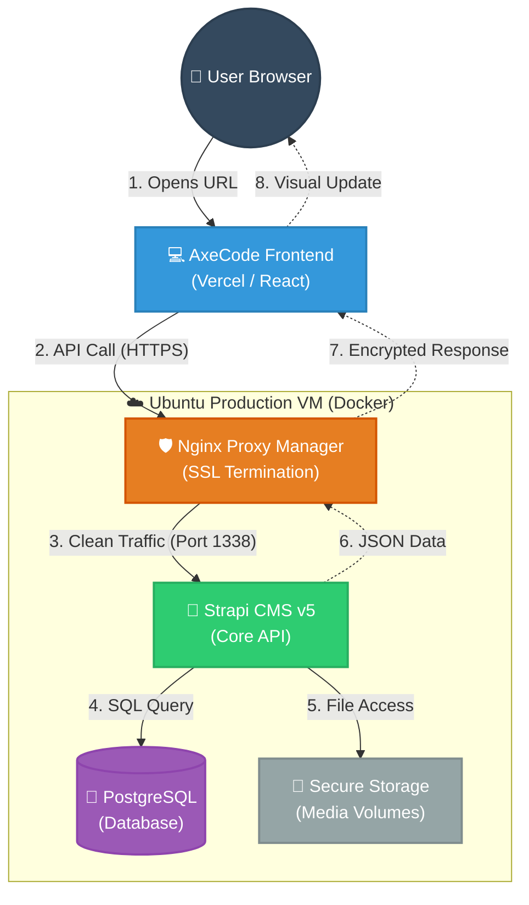
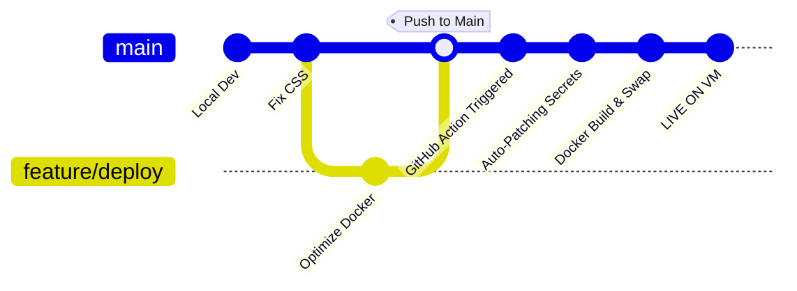

# 🚀 The AxeCode Request Story: A Complete Journey

This document explains the technical lifecycle of a data request and the automated deployment flow within the AxeCode ecosystem.

---

## 🧭 1. The Dynamic Request Journey (Real-time Flow)

---

## 🏗️ 2. Detailed Technical Breakdown

### Phase A: The User's Action
1.  **Interaction**: A student clicks "Enroll in Course" on the React/Vite frontend (hosted on Vercel).
2.  **API Call**: The frontend sends an HTTPS request to `https://axecode.duckdns.org/api/enrollments`.

### Phase B: Entering the Secure VM
3.  **Security Gate (Nginx Proxy Manager)**:
    -   The request arrives at Port **443** (HTTPS).
    -   Nginx decrypts the SSL certificate (Let's Encrypt).
    -   It checks the `Proxy Host` rules we configured to find the internal `axe-strapi` container.

### Phase C: Strapi & Data Processing
4.  **Identity Check**: Strapi's security middleware validates the **JWT Token** (using the `jwtSecret` we established).
5.  **Data Storage**: Strapi sends a SQL query to the `axe-postgres` container on the private `axe-network`.
6.  **Response Generation**: Strapi sends back a JSON response (e.g., `200 OK`).

---

## 🛠️ 3. The Deployment Story (Automatic CI/CD)
When you update the code, the "AxeCode Automation Engine" ensures zero-downtime:

1.  **The Trigger**: Run `git push origin main`.
2.  **The Runner**: GitHub connects to your **Self-Hosted Runner** inside the VM.
3.  **Auto-Patching**: The script verifies and adds any missing `JWT_SECRET` automatically.
4.  **Zero-Downtime**: Docker Compose swaps the containers in seconds.

---

> [!TIP]
> **Pro Debugging**: If the website isn't loading, check the **Nginx Proxy Manager Logs** first (Port 81). 90% of connectivity issues are resolved there.

---
